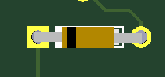
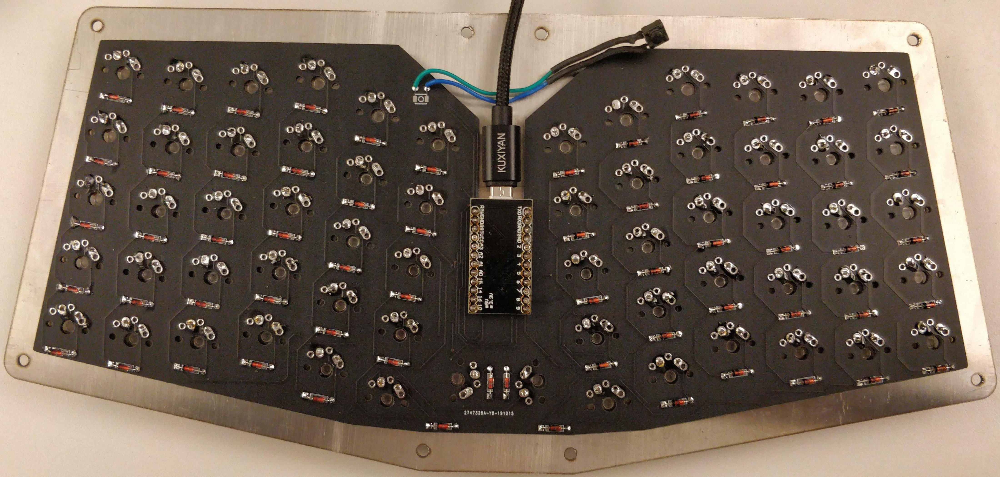

# UA62
A Universal PCB for the atreus62 by profet23
#### Firmware availble on the qmk configurator or the qmk repo: 
* https://github.com/qmk/qmk_firmware
* https://config.qmk.fm/#/ua62/LAYOUT (default layout to come)
* no default layout, so grab the json layout and upload it if you want a base layout to start from.

#### Build tips
* Diode direction for through hole  
   
 
* The pro micro and diodes are soldered to the bottom of the pcb.  
 
### Changes
1. Added universal switch holes for MX/Alps, Matias/Choc
2. Added support for through-hole diodes
3. Fixed edge cuts: They were off center from the middle of the pcb.
4. Rounded the sharp corners.
5. Uncomplicated the trace layout.
6. Updated pinout for pro micro.
7. Updated Silkscreen.

Uses MIT licensed footprints originally sourced from here: https://github.com/keebio/Keebio-Parts.pretty
